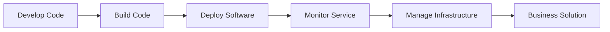

# Framework

+ Solutions = Needs + Services
  + Services = Operations + Software
    + Software = Infra + Source Code
      + SourceCode = Community + Conditions
        + Conditions = Standards + Techstack

### source code to a business solution:

The stages from basic conditions to a full-formed business solution:

### Tech Conditions = Tech Stack + Code Standards + Tools
+ This encompasses the selection of languages, frameworks, and tools used for development, as well as the standards and best practices for writing code.

### Source Code = Tech Conditions + Developer Expertise + Business Requirements
+ Function
+ The creation of the source code is derived from the technology conditions, combined with the expertise of the developers with the business requirements. 
+ Source Code = Development Environment + Developer Expertise + Business Requirements + Data:** The source code is written within the development environment by developers who apply their expertise to design and implement the necessary features based on the business requirements and data.

### Software = Source Code + Testing + Integration
+ Idea as a Code
+ The software is generated by not just the source code, but also by all the testing and integration processes that ensure the code works as intended.
+ Tested Software = Source Code + Quality Assurance (QA)
+ The source code undergoes QA processes, including unit tests, integration tests, and system tests, resulting in a reliable and functional software application.

### Deployment = Software + Infrastructure
+ Continuous Update
+ Deployment includes implementing the software created and preparing the underlying infrastructure to support that software.

+ Deployable Software = Tested Software + CI/CD Processes
+ Continuous Integration and Continuous Deployment (CI/CD) processes are used to build, test, and prepare the software for deployment.
 
+ Running Software = Deployable Software + Appropriate Infrastructure
+ The final running software is an outcome of deploying the software to appropriate infrastructure, which could be on premises, cloud-based, or hybrid.

### Services = Deployment + Maintenance + Monitoring + User Feedback 
+ Availability
+ Updates
+ improvement
+ Services are a result of not only the deployed software but also the ongoing maintenance and updates made to ensure the services function optimally and remain relevant.

### Solution = Services + User Acceptance
+ Meet business requirements
+ Solve a need
+ Finally, a solution emerges from the services provided, which then has to be accepted and found useful by the users (reflecting their needs).
+ Business Alignment
+ A business solution is the final output, delivering the proposed services effectively while aligning with broader business goals, such as cost reduction, process efficiency, and customer satisfaction goals.

### Business Solution = Solution + Business Value
+ Bring Revenue
+ A business solution not only solves a need but also brings value to the business, such as increasing efficiency, reducing costs, or creating new revenue opportunities.
 
---

### Develop Source Code
+ This is the first step in transforming an idea into a software business solution. The process starts with writing the source code, which involves translating business requirements into a programming language. Developers use integrated development environments (IDEs) and development frameworks to write, test, and debug the code.

### Build Machine Code
+ This step involves compiling the source code and generating executable files or libraries that can be deployed.
+ Build tools like Maven, Gradle, or Make are used to automate this process and manage dependencies.

### Test
Testing is the process of evaluating a system or component during or at the end of the development process to determine whether it satisfies the specified requirements. 
It helps find bugs and ensure that the intended logic for the solution is working correctly.

### Deploy
Once the code is built, it needs to be deployed to the appropriate computing environments. 
This can involve deploying to physical servers, virtual machines, containers, or cloud platforms. Infrastructure-as-Code (IaC) tools like Terraform or configuration management tools like Ansible are utilized to automate and ensure consistent deployments.
Deployment refers to all the processes involved in getting new software or hardware up and running properly in its environment, including installation, configuration, running, testing, and making necessary changes. 
This will usually be performed on different environments from development to staging and then production.

### Monitor Service
After deployment, it is crucial to monitor the application and infrastructure to gain insights into performance, availability, and issues.
Monitoring tools such as Prometheus, Grafana, or ELK Stack are used to collect and visualize metric and log data, enabling proactive management and troubleshooting.
Monitoring
After the software is deployed and operational, monitoring activities take place to ensure the application's uptime and performance meet the expected levels. 
The monitoring can notify about any errors that crop up with the system in real time.

### Manage Infrastructure
Managing the infrastructure involves tasks like scaling resources, patching and updating software, managing access and security controls, and ensuring compliance with industry standards. 
Infrastructure management tools like Kubernetes, Puppet, or Chef streamline these tasks and automate maintenance activities.

### Business Solution
+ Business Solution: Finally, the combination of developed code, deployed code to infrastructure, and effective management results in a functional business solution. 
+ This solution could be a web application, a mobile app, an API service, or any other software-based product that solves a specific business problem and meets customer needs.

Eventually, with a combination of the steps above, the developed code turns into a business solution that helps solve a specific problem or address a business need. This solution, while in operation, can still undergo, refinement, maintenance and various iterations as needed to continue to meet business requirements effectively in the changing environment.
Feedback & Iterations
Feedback is collected about the software's performance, user experience, and more. 
Based on this feedback, further iterations and improvements can be made to the software to better meet user needs and business goals.

Below is an example of what the code might look like. Please note that this code needs to be placed in a compatible editor to create the desired graph:

